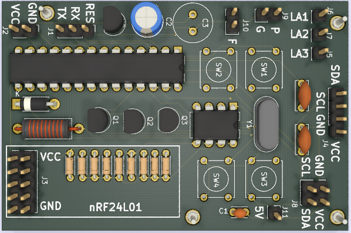
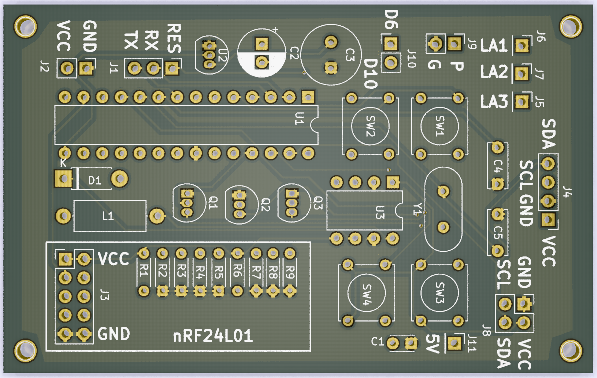
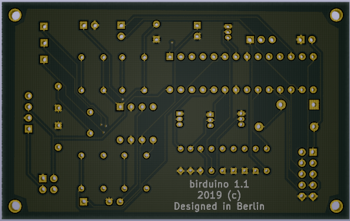

# birduino
Prototype board for common projects

Current version: 1.1

The PCB images:

3D view

Front

Back

Main features:

  * Microcontroller: ATMEGA328
  * Main voltage: 3.7 V
  * Radio card: nRF24L01
  * Sensor: Temperature DS18B20
  * Display: OLED
  * Buttons: 4
  * Setup output: 5V
  * Power controls: 3 MOSFET 2N7000
  * Analog reader: 1 pin at J9
  * Free pins: 2, D6 and D10
  * Programming: Onboard serial programming
